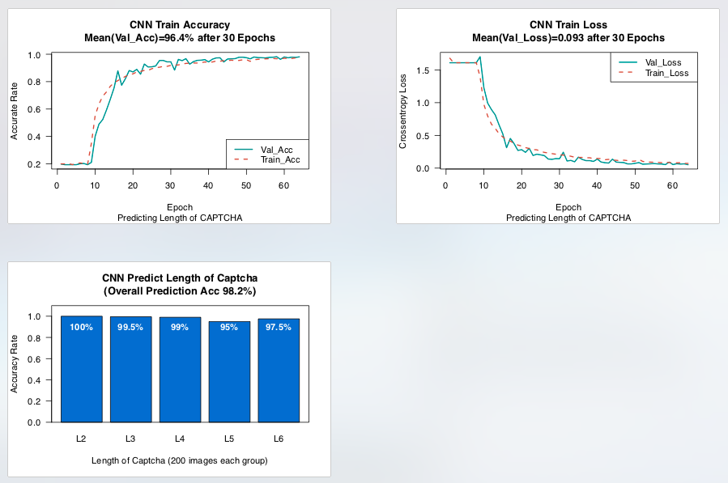
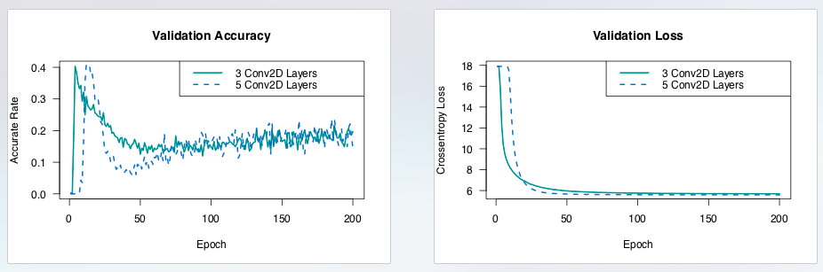

# captcha_len
Contains all the codes to recognize the lenght of text in captcha image.   
In this example the training data set has the image with 2-6 numbers.   
The CNN model is 3 layers of Conv2D, 2 full connected layers and 1 softmax output layer.  
Mean accuracy is 96.4% after 30 epochs,

Partially refer to Author:kemo's captcha train code (with four numbers) on github

# captcha_cnn
Contains a 3 Conv2D layers CNN network to predict the captcha image text.  
The 3 layer is proved to gain the similar outcome performance when recognize captcha with uppercase letters and numbers.

Refer to 
G. Ye, Z. Tang, D. Fang, Z. Zhu, Y. Feng, P. Xu, X. Chen, and Z. Wang, “Yet Another Text Captcha Solver: A Generative Adversarial Network Based Approach,” in Proceedings of the 2018 ACM SIGSAC Conference on Computer and Communications Security, CCS ’18, (New York, NY, USA), pp. 332–348, ACM, 2018. event-place: Toronto, Canada
